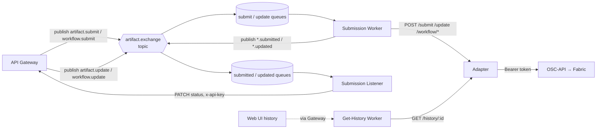

# OSC-Artifact-Submission

> The asynchronous **submission pipeline** of the Open Science Chain – Information System (OSC-IS): the message broker and the worker services that carry research artifacts and workflows from the API Gateway onto the Hyperledger Fabric blockchain — and carry the results back.

This repository is a small fleet of independently deployable services that sit *between* the [API Gateway](../OSC-APIGateway) and the blockchain access layer ([OSC-API](../OSC-API)). They turn a slow, failure-prone ledger write into a resilient, decoupled, event-driven flow.

---

## Executive summary

When a researcher submits an artifact, the API Gateway stores it immediately and returns success — but the *authoritative* record must be written to a blockchain, which is slow and can fail. This repository is what makes that possible without making the user wait:

- A **message broker** (RabbitMQ) buffers submission commands so producers and consumers never block each other.
- A **Submission Worker** consumes those commands and drives the blockchain write.
- An **Adapter** translates OSC-IS data into the format the blockchain access layer expects and authenticates to it with a token.
- A **Submission Listener** hears the "it's on the ledger now" events and tells the API Gateway to update its records.
- A **Get-History Worker** serves the immutable on-chain history of any artifact back to the UI, with caching so the blockchain isn't hammered.

The result: the user gets an instant response, the ledger write happens reliably in the background, and the system self-heals across restarts and transient outages.

---

## Services at a glance

| Service | Tech | Role | Port |
|---|---|---|---|
| **broker** | RabbitMQ (custom image) | Topic exchange + durable queues + bindings for the whole pipeline | 5672 / 15672 |
| **submission_worker** | Python | Consumes `*.submit` / `*.update`; calls the adapter; publishes `*.submitted` / `*.updated` | 8000 (health) |
| **submission_listener** | Python | Consumes `*.submitted` / `*.updated`; PATCHes the API Gateway (API key) | 8000 (health) |
| **adapter** | Python / Flask | Anti-corruption layer: reshapes OSC-IS DTOs → OSC-API form; token auth; submit / update / history | 5000 |
| **get_history_worker** | Python / FastAPI | Cache-aside read of on-chain history via the adapter; pagination + ordering | 8002 |
| **mock-osc-api** | Python / FastAPI | Local stand-in for OSC-API so the full pipeline runs offline | 3004 |
| **fabric-bridge** | (legacy) | Original direct-to-Fabric bridge using mounted wallet identities — **superseded by `adapter` + OSC-API** | 4000 |

> **Architecture note.** Early designs had workers talk to Fabric directly using identity material mounted from an S3 bucket (`fabric-bridge`). That approach was retired. The shipped system routes all blockchain access through the **`adapter` → OSC-API** path, where OSC-API holds the Fabric identities and authenticates the adapter with a bearer **token**. `fabric-bridge` remains in the repo for historical reference only.

---

## Pipeline overview



**Routing keys** (all on the single topic exchange `artifact.exchange`):

| Command (Gateway → Worker) | Event (Worker → Listener) |
|---|---|
| `artifact.submit` | `artifact.submitted` |
| `artifact.update` | `artifact.updated` |
| `workflow.submit` | `workflow.submitted` |
| `workflow.update` | `workflow.updated` |

The complete queue/binding topology is documented in [docs/messaging-topology.md](docs/messaging-topology.md).

---

## Data transformation (the Adapter)

The adapter is an **anti-corruption layer**. It shields the OSC-IS domain model from the OSC-API/Fabric wire format:

- Reshapes an artifact into `mandatory_public_fields` (title, description, submission_comment) + `public_fields` (keywords, doi, url, footprint, manifest, …) + `private_fields`.
- Prefixes ids: `osc-is-artifact-<uuid>` / `osc-is-workflow-<uuid>`.
- Submits as form data to `OSC-API /v1/artifacts/new|update` (and `/v1/workflows/...`) with `Authorization: Bearer <ADAPTER_API_TOKEN>`.
- On history reads, normalizes OSC-API's `PublicCustomFields` records back into OSC-IS artifact shape and synthesizes a stable `txId` per history entry.

---

## Running the pipeline locally

The whole stack runs offline using the bundled mock OSC-API:

```bash
# from this repo
cp .env.example .env     # set RABBITMQ_USER/PASS, ADAPTER_API_*, gateway API key, etc.
docker compose up -d
```

This starts RabbitMQ (with all queues + bindings baked into the broker image), the adapter, both workers, and the listener on the shared `osc-api-services-network`. Point `ADAPTER_API_URL` at `mock-osc-api` for a fully local end-to-end run, or at a real OSC-API instance to hit an actual Fabric network.

> **Operational note.** Queue bindings live in `broker/definitions.json` and are loaded into the broker image at build time. If the broker is ever run from a stale image, workflow bindings can be missing — rebuild with `docker build --no-cache ./broker` so the current definitions are baked in.

---

## Testing

Each service has its own `requirements.txt` and `test_*.py` (pytest):

```bash
cd submission_worker   && python -m pytest -v
cd ../submission_listener && python -m pytest -v
cd ../adapter          && python -m pytest -v
cd ../get_history_worker && python -m pytest -v
```

Pre-commit hooks (black/isort/flake8 + TruffleHog secret scan) are installed via `bash setup-hooks.sh`.

---

## Documentation

| Document | Contents |
|---|---|
| [docs/ARCHITECTURE.md](docs/ARCHITECTURE.md) | Patterns, tactics, prioritized quality attributes, per-service responsibilities, failure handling. |
| [docs/messaging-topology.md](docs/messaging-topology.md) | Exchange, queues, bindings, routing keys, message shapes, delivery semantics. |

---

*Part of the OSC-IS platform: [OSC-WebApp](../OSC-WebApp) · [OSC-APIGateway](../OSC-APIGateway) · [OSC-IS-Infra](../OSC-IS-Infra) · [OSC-API](../OSC-API) · [OSC-Chaincode](../OSC-Chaincode) · [OSC-Docker](../OSC-Docker) · [OSC-Network](../OSC-Network).*
