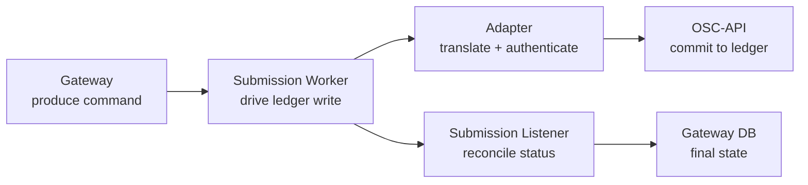
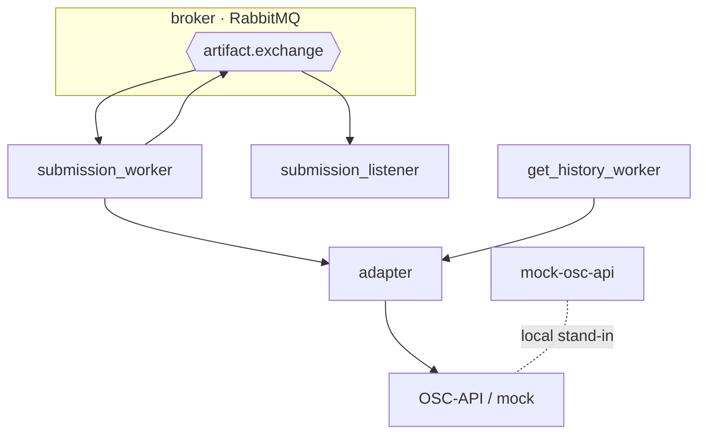

# OSC-Artifact-Submission — Architecture

This document describes the architecture of the OSC-IS submission pipeline: the **patterns and tactics** used by the broker and worker services, the **quality attributes** they exist to satisfy, and the **trade-offs** taken. It complements [messaging-topology.md](messaging-topology.md), which specifies the concrete exchange/queue/binding layout.

- [1. Architectural context](#1-architectural-context)
- [2. Prioritized quality attributes](#2-prioritized-quality-attributes)
- [3. Architectural patterns](#3-architectural-patterns)
- [4. Tactics by quality attribute](#4-tactics-by-quality-attribute)
- [5. Service responsibilities](#5-service-responsibilities)
- [6. Runtime scenarios](#6-runtime-scenarios)
- [7. Failure handling](#7-failure-handling)
- [8. Trade-offs and constraints](#8-trade-offs-and-constraints)

---

## 1. Architectural context

This repository implements the **asynchronous integration tier** of OSC-IS. Its architectural mandate is to connect three systems that operate at very different speeds and reliability profiles:

| System | Speed | Reliability | Protocol |
|---|---|---|---|
| API Gateway (interactive) | milliseconds | high | HTTP/REST |
| Message broker | milliseconds | high (durable) | AMQP |
| Blockchain via OSC-API | seconds, can fail | eventually consistent | HTTP + token → Fabric gRPC |

The central design problem is **temporal decoupling**: let the fast, interactive front end proceed immediately while the slow, fallible ledger write completes (and is reconciled) out of band. Every pattern below serves that goal.

---

## 2. Prioritized quality attributes

| # | Quality attribute | Why prioritized | Representative scenario |
|---|---|---|---|
| 1 | **Resilience / reliability** | A submission must never be silently lost, even if the blockchain or a worker is down. | The adapter returns 502; the message is negatively-acknowledged and redelivered, not dropped. |
| 2 | **Scalability / load-leveling** | Submission bursts must not overwhelm the blockchain. | 50 artifacts submitted at once are buffered in the queue and drained at the ledger's pace. |
| 3 | **Modifiability** | The blockchain back end changed (direct Fabric → OSC-API) without touching producers. | Swapping `fabric-bridge` for `adapter` required only a URL change in the worker. |
| 4 | **Security** | Service-to-service calls must be authenticated; identities must not leak. | The worker→Gateway PATCH uses an API key; the adapter→OSC-API call uses a bearer token. |
| 5 | **Observability** | Operators must trace a submission across five services. | A single `x-correlation-id` follows the artifact end-to-end. |
| 6 | **Performance** | History reads must be fast despite ledger latency. | The Get-History Worker serves repeat reads from a TTL cache. |

---

## 3. Architectural patterns

### 3.1 Message broker / publish–subscribe

A single RabbitMQ **topic exchange** (`artifact.exchange`) routes commands and events by routing key to durable queues. Producers (Gateway, workers) and consumers (workers, listener) are fully decoupled in time and identity.

### 3.2 Competing consumers

Each queue can be served by one or more identical worker instances. Throughput scales horizontally by adding workers; RabbitMQ load-balances deliveries. This is the scalability backbone.

### 3.3 Pipes and filters

The submission flow is a pipeline of independent processing stages connected by queues:

Each filter is single-purpose, independently testable, and independently deployable.

### 3.4 Anti-corruption layer (Adapter)

The **adapter** isolates the clean OSC-IS domain model from the OSC-API/Fabric wire format (group/schema identifiers, `mandatory_public_fields`/`public_fields`/`private_fields`, id prefixes, PHP-friendly payload quirks). The rest of the system never sees these details. This is what made the back-end migration a one-line change for producers.

### 3.5 Cache-aside (Get-History Worker)

History reads check a `TTLCache` first and fall back to the adapter on a miss, storing both `asc`/`desc` orderings and the total count. This protects the (slow) ledger from repeated reads and gives the UI predictable latency.

### 3.6 Choreographed eventual consistency

There is no central orchestrator. Each service reacts to messages and emits new ones — a **choreography**. The off-chain database converges to the on-chain truth through the `submitted`/`updated` event → listener → PATCH loop.

---

## 4. Tactics by quality attribute

### Resilience / reliability

| Tactic | Implementation |
|---|---|
| **Durable messaging** | Durable exchange + queues; messages survive broker restarts. |
| **Acknowledge after success** | Workers `ack` only after the downstream call succeeds; failures `nack` for redelivery (no silent loss). |
| **Reject-without-requeue on poison** | Permanently invalid messages are rejected (not infinitely requeued) to avoid hot loops. |
| **Restart policies** | All containers run with `restart: unless-stopped`; bindings persist via the broker definitions + restart policy. |
| **Graceful upstream timeouts** | Adapter and history worker apply explicit connect/read timeouts and return structured errors. |

### Scalability / load-leveling

| Tactic | Implementation |
|---|---|
| **Bound the work in progress** | The queue absorbs bursts; consumers pull at their own rate. |
| **Stateless workers** | No worker-local state, so instances scale horizontally. |
| **Separate queues per concern** | submit/update vs submitted/updated are independent, so back-pressure in one doesn't stall the other. |

### Modifiability

| Tactic | Implementation |
|---|---|
| **Anti-corruption layer** | Adapter localizes all knowledge of the blockchain wire format. |
| **Configuration over code** | Every endpoint/credential is an environment variable (`FABRIC_BRIDGE_URL`, `BRIDGE_URL`, `ADAPTER_API_*`, `API_GATEWAY_*`). |
| **Service-label indirection** | `peer_client` resolves `adapter` vs `fabric-bridge` by host, so the upstream can change without code edits. |

### Security

| Tactic | Implementation |
|---|---|
| **Authenticate service callers** | Worker→Gateway uses `x-api-key` + `x-service-role`; adapter→OSC-API uses a bearer token. |
| **Centralize identity custody** | Fabric identities live behind OSC-API, not mounted into every worker. |
| **TLS verification** | Adapter verifies TLS to OSC-API (`VERIFY_TLS`). |
| **Secret hygiene** | Credentials injected via env / Secrets Manager; TruffleHog pre-commit scan. |

### Observability

| Tactic | Implementation |
|---|---|
| **Correlation IDs** | `x-correlation-id` propagated across HTTP and message metadata. |
| **Health endpoints** | Every long-running service exposes `/health` for ECS/compose checks. |
| **Structured logging** | Consistent `time - logger - level - message` format across services. |

---

## 5. Service responsibilities

| Service | Consumes | Produces / calls | Notes |
|---|---|---|---|
| **submission_worker** | `artifact.submit/update`, `workflow.submit/update` | calls adapter `/submit`,`/update`,`/workflow/*`; publishes `*.submitted/*.updated` | Normalizes camelCase→snake_case for workflow patches before calling the adapter. |
| **submission_listener** | `artifact.submitted/updated`, `workflow.submitted/updated` | PATCHes Gateway artifact/workflow status (API key) | Needs both `API_GATEWAY_URL` and `API_GATEWAY_WORKFLOW_URL`. |
| **adapter** | HTTP from workers + history worker | OSC-API (token) | Anti-corruption layer; submit/update/history for artifacts and workflows. |
| **get_history_worker** | HTTP (via Gateway proxy) | adapter `/history/:id` | Cache-aside, pagination, ordering, UUID validation. |
| **mock-osc-api** | HTTP from adapter | — | Local FastAPI mock for offline E2E. |
| **fabric-bridge** | — | — | Legacy direct-to-Fabric bridge; retained for reference. |

---

## 6. Runtime scenarios

### 6.1 Submit an artifact

1. Gateway publishes `artifact.submit`.
2. Worker consumes, POSTs `/submit` to the adapter.
3. Adapter reshapes + posts to OSC-API (`/v1/artifacts/new`, bearer token) → Fabric commits.
4. Worker publishes `artifact.submitted` with the result.
5. Listener consumes and PATCHes the Gateway (`SUCCESS` + `blockchainTxId`).

### 6.2 Read artifact history

1. UI requests history via the Gateway, which proxies to the Get-History Worker.
2. Worker checks its TTL cache; on miss, GETs `/history/:id` from the adapter.
3. Adapter calls OSC-API history, normalizes `PublicCustomFields` records, synthesizes per-entry `txId`.
4. Worker caches both orderings and returns the requested page.

---

## 7. Failure handling

| Failure | Behavior |
|---|---|
| Adapter/OSC-API down or 502 | Worker `nack`s the message → redelivery; artifact stays `PENDING`. |
| Poison message (invalid payload) | Rejected without requeue to avoid a hot loop; logged for inspection. |
| Broker restart | Durable queues + definitions restore exchange/queues/bindings. |
| Missing `workflow.*` binding | Command published but unrouted — caught operationally; fixed by re-loading broker definitions. |
| Gateway unreachable from listener | PATCH retried; status reconciliation is idempotent (keyed by id). |
| Large history / slow ledger | Configurable connect/read timeouts; cache shields repeat reads. |

---

## 8. Trade-offs and constraints

| Decision | Benefit | Cost / risk |
|---|---|---|
| Asynchronous, broker-mediated submission | Resilience + load-leveling + responsiveness. | More services, more failure modes, eventual consistency to reason about. |
| Choreography (no orchestrator) | No single point of failure or bottleneck. | End-to-end flow is emergent; tracing requires correlation IDs. |
| Anti-corruption adapter | Back-end portability; clean domain model. | An extra network hop and translation step per submission. |
| Single topic exchange for all entities | One simple binding model. | Every routing key needs a binding; a missing one silently drops messages. |
| Identities behind OSC-API (vs mounted wallets) | Centralized custody, simpler/safer workers. | OSC-API becomes a critical dependency on the write/read path. |
| In-image broker definitions | Reproducible topology baked into the image. | A stale image yields stale bindings; rebuild discipline required. |

---

*See [messaging-topology.md](messaging-topology.md) for the concrete exchange/queue/binding specification, and [OSC-APIGateway/docs/ARCHITECTURE.md](../../OSC-APIGateway/docs/ARCHITECTURE.md) for the producer side.*
