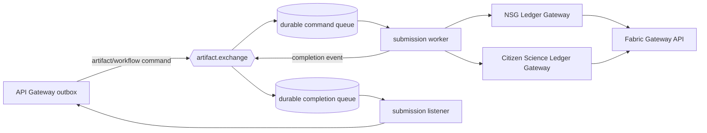

# Messaging Topology

OSC-IS uses RabbitMQ topic exchanges and durable queues to isolate the
interactive API from Fabric latency. The executable local definition is
[`broker/definitions.json`](../broker/definitions.json). The worker and listener
also declare the same topology so Amazon MQ does not depend on loading a broker
image definition.

## Main flow



Commands use `artifact.submit`, `artifact.update`, `workflow.submit`, and
`workflow.update`. Completion events use the corresponding `submitted` and
`updated` routing keys.

## Delivery contract

- Producers publish persistent messages and wait for publisher confirms.
- Consumers use explicit acknowledgements with a prefetch of one.
- A command is acknowledged only after a confirmed completion event is
  published, or after a permanent validation failure is reported.
- HTTP timeouts, connection failures, HTTP 408/425/429, and HTTP 5xx responses
  are transient.
- Validation errors and other non-retryable HTTP 4xx responses are permanent.
- Fabric correlation receipts make redelivered ledger commands idempotent.
- API status reconciliation is idempotent by entity ID.

## Bounded retry

Hot `requeue=true` loops are not used. A transient failure rejects the message
to a dead-letter exchange:

```text
main queue -> retry exchange -> TTL retry queue -> artifact.exchange -> main queue
```

The default delay is five seconds and the default maximum is four delivery
attempts. RabbitMQ `x-death` metadata is the retry counter. The worker emits a
terminal `FAILED` completion after exhaustion. The listener parks an exhausted
or permanently invalid completion in `osc.status.failed.queue` for operator
inspection.

## AWS profile

Amazon MQ connections must use AMQPS with certificate and server-name
verification. The evidence environment uses a private single-instance broker to
control cost. A production design should use a multi-AZ broker and quorum queues;
that availability profile is documented but is not claimed as tested by this
experiment.

## US-RSE 2026 guest compatibility

The interactive demonstration does not introduce a second broker protocol or
ledger path. Its API-generated records use the existing strict v3 envelope,
organization-scoped Ledger Gateway, durable queues, publisher confirms,
bounded retries, and correlation receipt idempotency.

The API supplies a random guest alias and an authenticated request identifier
that is server-bound to the selected demonstration organization. The worker
allowlists forwarded keys before calling the Ledger Gateway. Browser-only or
unknown fields—including file bytes and original filenames—are discarded even
if a compromised producer adds them to a broker message. The Ledger Gateway
then applies its own closed Joi schema and rejects mismatched organization,
MSP, request, operation, or correlation metadata.

Deployment must configure `NSG_ORGANIZATION_ID` and
`CITIZEN_SCIENCE_ORGANIZATION_ID` to the exact database UUIDs seeded for the
`neuroscience-gateway` and `citizen-science` slugs. Display names and slugs are
not substitutes for these IDs. Redelivery uses the same record UUID and
correlation ID, allowing the v3 chaincode receipt to return the prior result
without a duplicate ledger revision.
