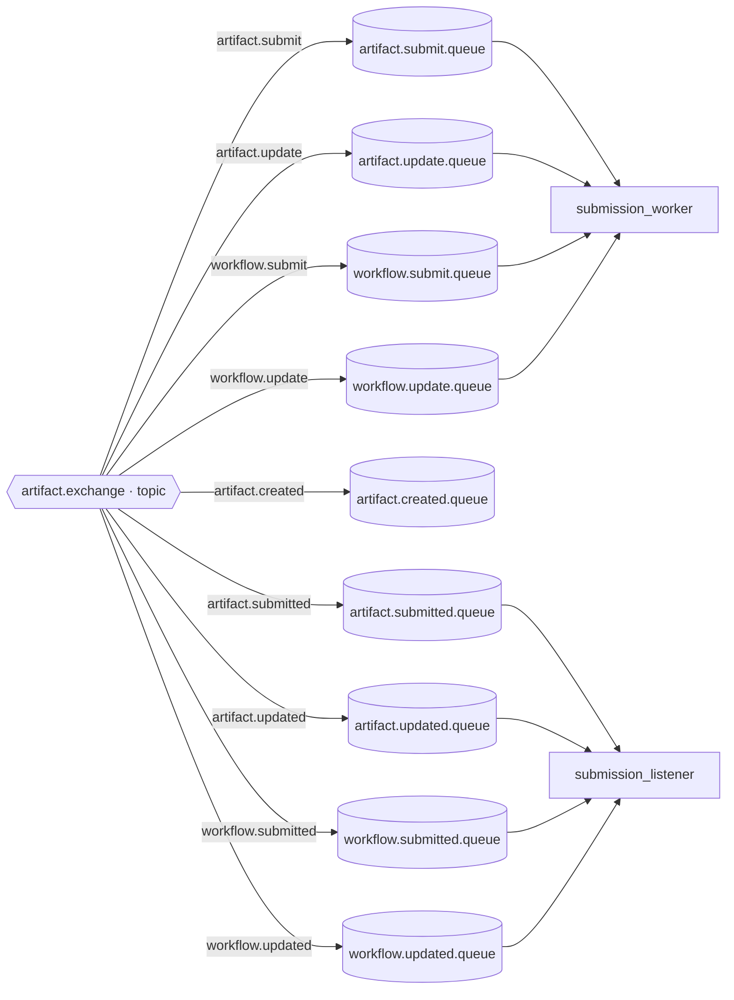
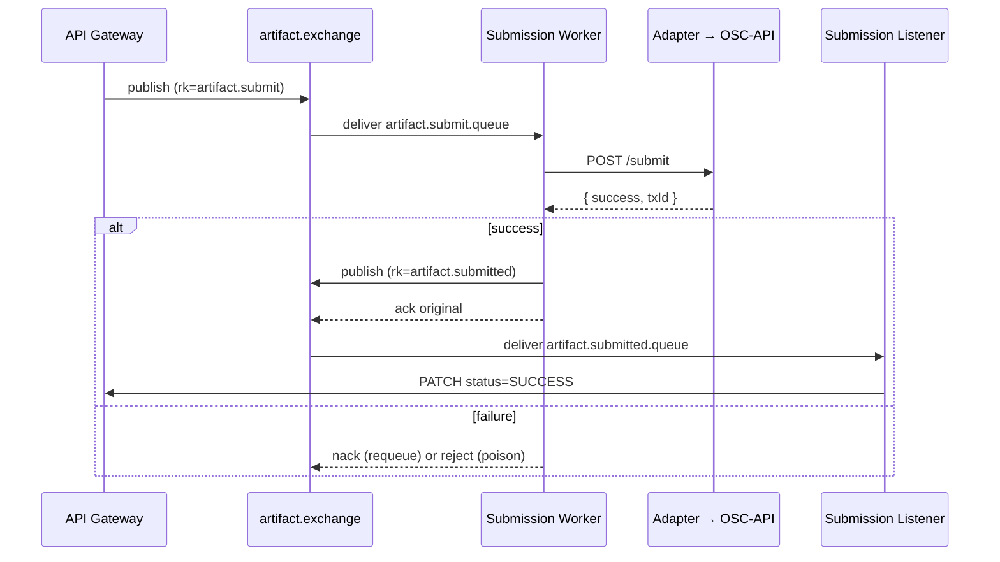

# Messaging Topology

The concrete RabbitMQ layout used by the OSC-IS submission pipeline. The topology is declared in [`broker/definitions.json`](../broker/definitions.json) and baked into the broker image, so it is recreated deterministically on every broker start.

---

## Exchange

| Name | Type | Durable | Purpose |
|---|---|---|---|
| `artifact.exchange` | `topic` | yes | Single exchange routing **all** artifact and workflow commands and events by routing key. |

A topic exchange was chosen so that one exchange can fan submission *commands* to worker queues and *events* to listener queues purely by routing-key convention, with no code changes to add a new message type — only a new binding.

---

## Queues

All queues are durable.

| Queue | Bound routing key | Consumed by |
|---|---|---|
| `artifact.submit.queue` | `artifact.submit` | submission_worker |
| `artifact.update.queue` | `artifact.update` | submission_worker |
| `artifact.submitted.queue` | `artifact.submitted` | submission_listener |
| `artifact.updated.queue` | `artifact.updated` | submission_listener |
| `artifact.created.queue` | `artifact.created` | (reserved) |
| `workflow.submit.queue` | `workflow.submit` | submission_worker |
| `workflow.update.queue` | `workflow.update` | submission_worker |
| `workflow.submitted.queue` | `workflow.submitted` | submission_listener |
| `workflow.updated.queue` | `workflow.updated` | submission_listener |

---

## Bindings



Producers and their routing keys:

| Producer | Publishes routing keys |
|---|---|
| **API Gateway** | `artifact.submit`, `artifact.update`, `workflow.submit`, `workflow.update` |
| **Submission Worker** | `artifact.submitted`, `artifact.updated`, `workflow.submitted`, `workflow.updated` |

---

## Message lifecycle



---

## Delivery semantics

- **Acknowledgement:** the worker acknowledges a command only after the downstream call resolves. A transient failure results in `nack`/requeue; a structurally invalid ("poison") message is rejected without requeue.
- **Durability:** durable exchange + durable queues mean in-flight messages survive a broker restart.
- **At-least-once:** consumers must tolerate redelivery. Status reconciliation at the Gateway is idempotent (keyed by entity id), so duplicate `submitted`/`updated` events converge to the same state.
- **Ordering:** not guaranteed across the exchange; the pipeline does not depend on cross-message ordering, only on per-entity convergence.

---

## Operational notes

- The full topology is defined in `broker/definitions.json` and applied at broker start. If bindings appear missing at runtime (commonly the `workflow.*` bindings after running a stale broker image), rebuild the broker image so current definitions are baked in:
  ```bash
  docker build --no-cache ./broker
  ```
- RabbitMQ management UI is exposed on `:15672` for inspecting exchanges, queues, bindings, and message counts.
- Credentials come from `RABBITMQ_USER` / `RABBITMQ_PASS`; `rabbitmqctl` works without auth on-box, while `rabbitmqadmin` requires `-u/-p`.
